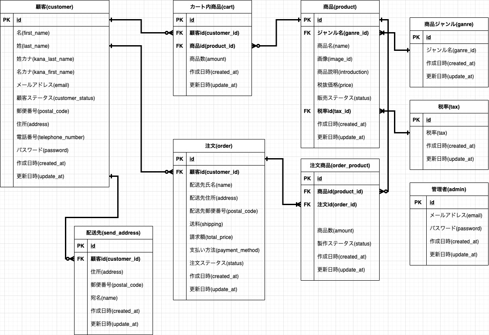
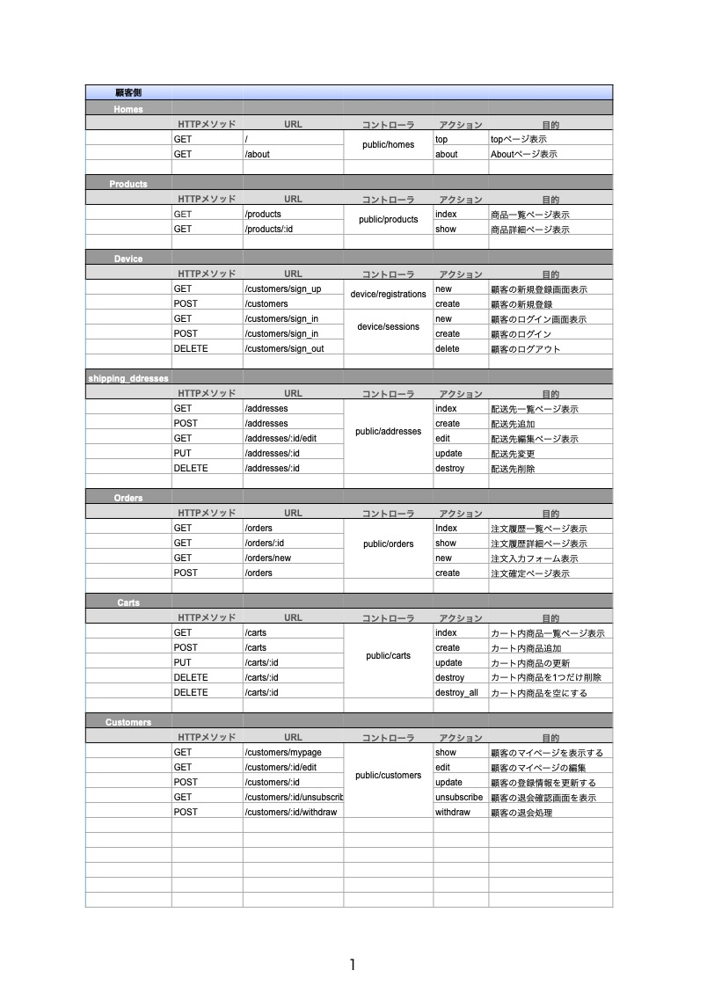
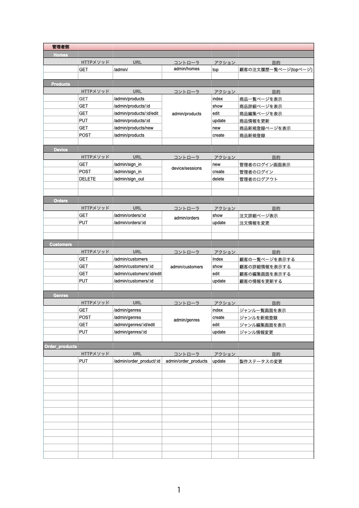

#  ECサイト「Nagano Cake」

DMMWEBCAMPのチーム開発課題で作成しました。
子供からお年寄りの方まで幅広い層をターゲットとし、
落ち着きのあるデザインとなっております。

## ER図

## アプリケーション詳細設計図

# 機能
## 管理者側

管理者の機能は以下の通りです。
1.管理者用メールアドレスとパスワードでのログイン
2.商品の新規追加、情報編集、販売停止状態への切り替え
3.顧客情報の閲覧、編集、退会状態への切り替え
4.注文ステータスと、商品の製作ステータスの切り替え
5.会員、商品の検索機能

## 顧客側

顧客の機能は以下の通りです。
1.顧客ユーザ登録、ログイン、ログアウト
2.自身の配送先登録と編集
3.自身の顧客情報編集
4.商品一覧の閲覧(この機能のみログイン不要)
5.商品をカートに入れる、個数変更、削除
6.カート内商品の注文、詳細確認
7.メール機能

# 開発環境

開発言語：Ruby
IDE:Cloud9
Ruby on Rails version5.2.6
ImageMagick-7.0.11

# 開発者

でんちゅう、はらてぃ、いとしん、あやみん

#開発期間
2021/6/12/から2021/6/31まで
